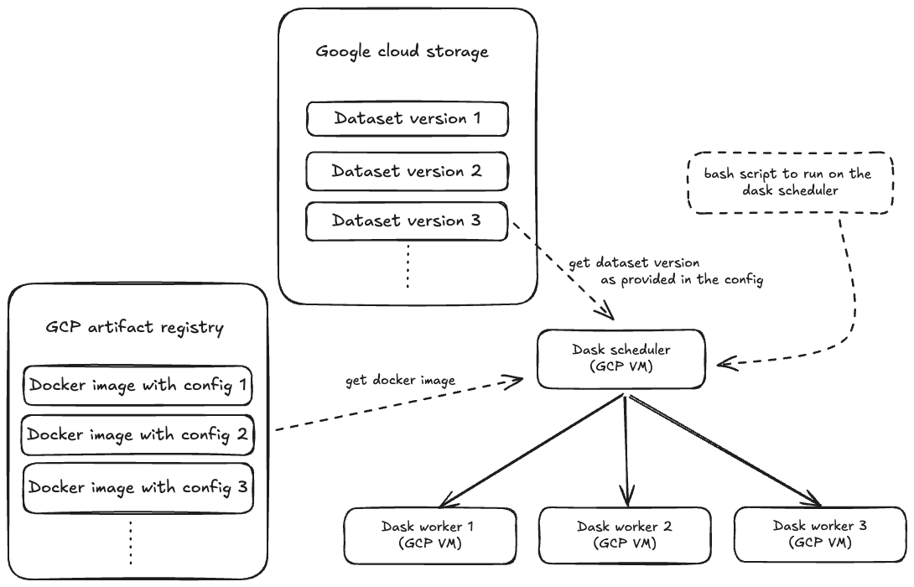

# Cyberbullying Detection

## 📚 Project Overview
This project is focused on developing a deep learning model to detect and classify hate speech, toxic comments, and cyberbullying content on online platforms. The key goal is to create a robust, scalable, and reproducible MLOps pipeline for building and serving deep learning projects to the cloud.

*Note: The objective of this project is to design and implement an MLOps pipeline on the cloud, tailored for a deep learning application. While the current text classification model—a fine-tuned BERT-based model—serves as a foundational example, it is acknowledged that this may not be the most optimal solution for the problem at hand. However, the developed infrastructure is fully capable of supporting more advanced and high-performing models. This infrastructure is not only directly applicable to building better models but also serves as a versatile template for developing and deploying a wide range of deep learning applications.*

🛠️ Ensuring Reproducibility and Maintainability
- **Docker Containerization**: Packages the project, including dependencies, into a Docker container for consistent cross-platform deployment.
- **Data Version Control with DVC**: Manages dataset changes with DVC, enabling reproducible experiments and seamless model retraining.
- **Distributed Data Processing with Dask**: Uses Dask for efficient, scalable data preprocessing and feature engineering.
- **Distributed Model Training with PyTorch**: Accelerates training with PyTorch's distributed capabilities, utilizing multiple GPUs or CPU cores.
- **Cloud-based Infrastructure**: Deployed on Google Cloud Platform (GCP), utilizing its scalable infrastructure, secure storage, Docker management, and Mlflow for model tracking.
- **Configuration Management with Hydra**: Employs Hydra-core for streamlined configuration management and enhanced reproducibility.

The project is divided into four parts(each in its own repo):
- Part 1: [Data collection and versioning]()
- Part 2: [Distributed data processing]()
- Part 3: [Distributed model training and evaluation]()
- Part 4: [Deployment and web app]()

This repository includes code for Part 2 only. 

---

# Part 2:
In Part 1, the datasets were versioned using DVC and stored in a Google Cloud Storage (GCS) bucket. In this section, the raw datasets are retrieved and transformed for cleaning and preprocessing. The transformed datasets are then stored in a new directory within GCS, tagged appropriately to indicate both the dataset version and the details of the transformations applied.

This processed dataset is later used to build a tokenizer using the tokenizers library from Huggingface (tokenizer construction was done on my local machine).

## Key Tools and Technologies
- **Dask**: Dask distributed used for setting up a dask scheduler and worker compute nodes.
- **GCS**: GCS bucket to retrieve raw dataset and store processed dataset.
- **GCP artifact registry**: To store docker images. 
- **HuggingFace tokenizers**: Tokeniziers library from huggingface was used to build a BPE tokenizer. 

## Distributed data processing setup
- A Docker image, containing the configuration file (managed with Hydra-core), required code, environment, dataset version, and transformation functions, is uploaded to the GCP Artifact Registry. Packaging these components together ensures seamless experiment reproducibility.
- A GCP instance group is created for Dask schedulers and worker nodes, with each VM instance in the group loaded with a Docker container built from the uploaded image.
- The configuration file specifies the dataset version to be used, enabling the appropriate raw dataset to be pulled from the GCS bucket into the Dask cluster nodes.
- Transformation functions defined in the configuration are applied to the raw dataset, and the processed data is stored in the same GCS bucket under a new directory.
- This setup enhances reproducibility by packaging the transformation functions and dataset version within the Docker container. Experiments can be traced back to the Docker image used to deploy the Dask cluster, providing detailed information on the configuration used for data processing.

  

